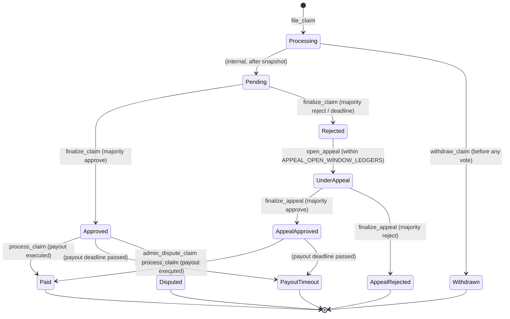

# Claim State Machine — Valid Status Transitions

This document defines every valid `ClaimStatus` transition in the niffyinsure
contract. Any transition not listed below **must revert**.

## Status Variants

| Discriminant | Status | Terminal? | Description |
|---|---|---|---|
| 0 | Processing | No | Initial state at filing |
| 1 | Pending | No | Awaiting voter action |
| 2 | Approved | Yes | Majority approved; awaiting payout |
| 3 | PayoutTimeout | Yes | Approved but payout deadline passed |
| 4 | Paid | Yes | Payout successfully executed |
| 5 | Rejected | Yes* | Majority rejected (*appeal may reopen) |
| 6 | UnderAppeal | No | Appeal vote in progress |
| 7 | AppealApproved | Yes | Appeal majority approved |
| 8 | AppealRejected | Yes | Appeal majority rejected |
| 9 | Withdrawn | Yes | Claimant withdrew before voting |
| 10 | Disputed | Yes | Admin disputed after approval |
| 11 | Appealed | — | RESERVED (never constructed) |

## State Machine Diagram

## Transition Rules

### Forward-only transitions
All transitions are strictly forward — no status may revert to a previous
state. The only exception is `Rejected → UnderAppeal`, which reopens the
claim for an appeal vote round.

### Terminal states
Terminal states (where `is_terminal()` returns `true`) are:
`Approved`, `PayoutTimeout`, `Paid`, `Rejected`, `AppealApproved`,
`AppealRejected`, `Withdrawn`, `Disputed`.

`UnderAppeal` is explicitly **not** terminal — the appeal must resolve
before the claim lifecycle ends.

### Invalid transitions (must revert)
Any direct transition not shown in the diagram above must revert.
Examples of invalid transitions:
- `Paid → Processing` (cannot restart a paid claim)
- `Withdrawn → Approved` (cannot approve a withdrawn claim)
- `Disputed → Pending` (cannot re-pend a disputed claim)
- `AppealRejected → UnderAppeal` (cannot re-appeal)

## References
- Source: `contracts/niffyinsure/src/claim.rs`
- Types: `contracts/niffyinsure/src/types.rs` (`ClaimStatus` enum)
- Events: `contracts/niffyinsure/src/events.rs` (`ClaimStatusChangedData`)
